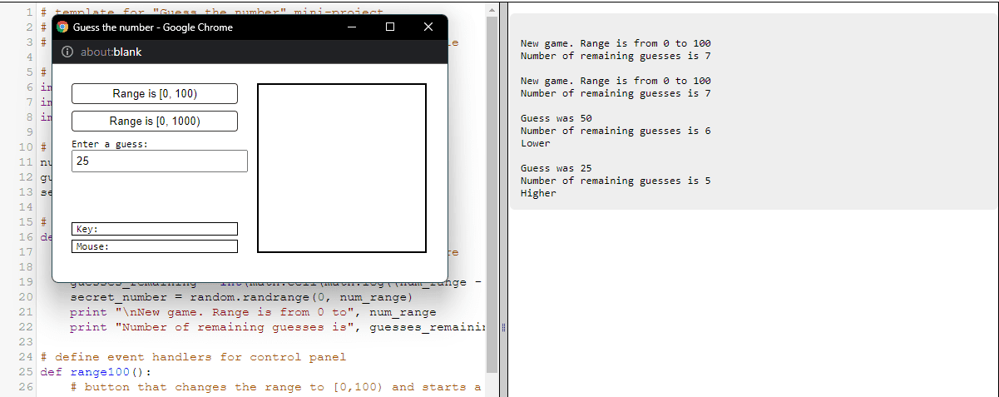

Guess the Number Game: Python Mastery in Action
===============================================  

[Game Link](https://py2.codeskulptor.org/#user38_ei0dID0C2V9LNbB.py) Just click on the play button to launch the game.  

The "Guess the Number" game is a testament to Python's power and versatility, conceived as the Week 2 project for Rice University's "Introduction to Interactive Programming in Python" MOOC. Utilizing the SimpleGUI library from CodeSkulptor, this project represents an immersive educational journey that takes learners into the realm of interactive Python programming.

## Key Features and Highlights:

1. *Educational Endeavor*: Aligned with the curriculum of the MOOC, this project offers a hands-on experience to reinforce Python fundamentals. It's a practical application of concepts learned in the course.

2. *Interactive Gameplay*: At its core, "Guess the Number" is a game of intellect and strategy. Participants must employ their Python skills to guess a hidden number within a specified range, making each attempt a thrilling intellectual challenge.

3. *User-Friendly Interface*: The game's interface, crafted using SimpleGUI, is designed for accessibility and ease of use. This ensures that learners can engage with the game without hindrance, focusing on the Python logic and problem-solving aspect.

4. *Immediate Feedback*: Players receive real-time feedback on their guesses, whether they are too high or too low. This feature encourages players to refine their strategies and make calculated guesses.

5. *Skill Enhancement*: Delving into the game's code provides a practical understanding of event-driven programming, user interface design and Python's logic implementation. Learners gain hands-on experience in a fun and interactive manner, reinforcing their Python proficiency.

The "Guess the Number" game transcends being a mere entertainment piece; it serves as a practical showcase of Python's capabilities in creating interactive experiences. It exemplifies how Python can be wielded as a versatile and robust programming language. Whether you're a course participant diligently completing an assignment or an enthusiast keen on honing your Python skills through an engaging numerical challenge, the "Guess the Number" game offers an enriching and educational expedition into the world of interactive Python programming.  

  
